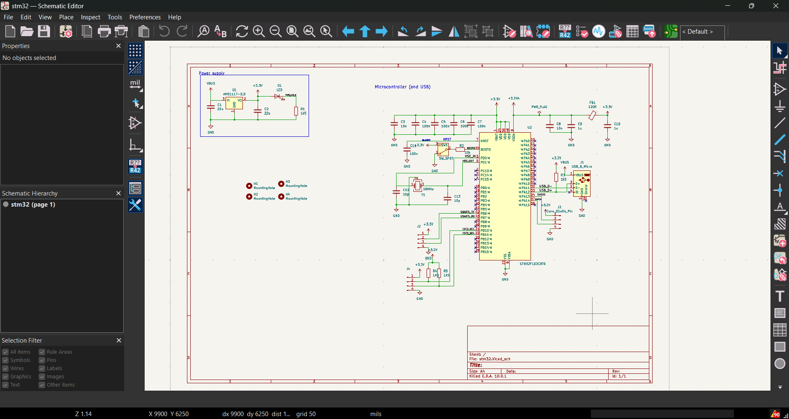
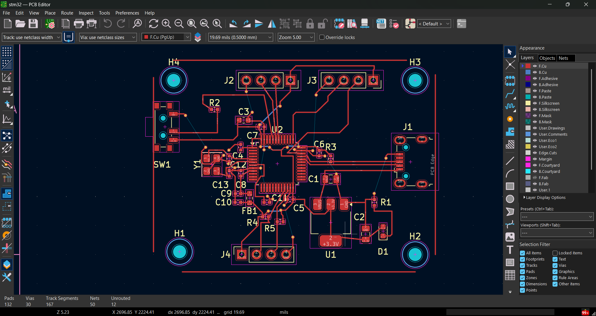
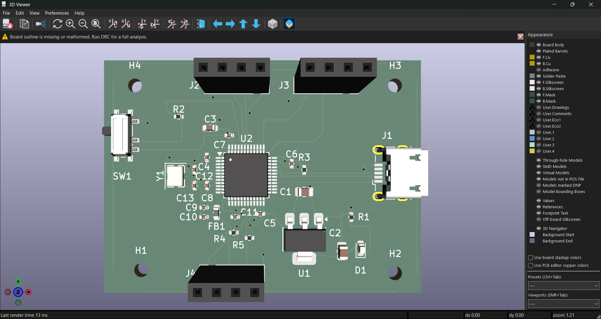

# 🔷 STM32F103C8T6 Custom Development Board

> Custom STM32F103C8T6 development board designed from schematic to PCB using KiCad.

Overview

A custom embedded development board built around the STM32F103C8T6 microcontroller, featuring power management, USB connectivity, external clock, and communication interfaces.

️ Features

-  STM32F103C8T6

-  USB Micro-B

-  AMS1117-3.3 Power Supply

- ️ 16 MHz HSE Crystal

-  USART

-  I²C

-  Decoupling & Power Filtering

-  LED & Control Circuitry

️ Tools

- KiCad — Schematic & PCB Design

- STM32CubeMX — MCU Configuration

- STM32CubeIDE — Firmware Development

- Embedded C

Design

### Schematic

### PCB Layout

### 3D View

Skills Demonstrated

`#STM32` `#EmbeddedSystems` `#KiCad` `#PCBDesign`

`#SchematicDesign` `#EmbeddedC` `#USART` `#I2C` `#USB`

Project Status

🟡 PCB Design — In Progress

Schematic → PCB Layout → Manufacturing → Assembly → Testing

Future Work

- Manufacture and assemble the PCB

- Program the STM32

- Test USB, USART and I²C

- Perform complete board validation
